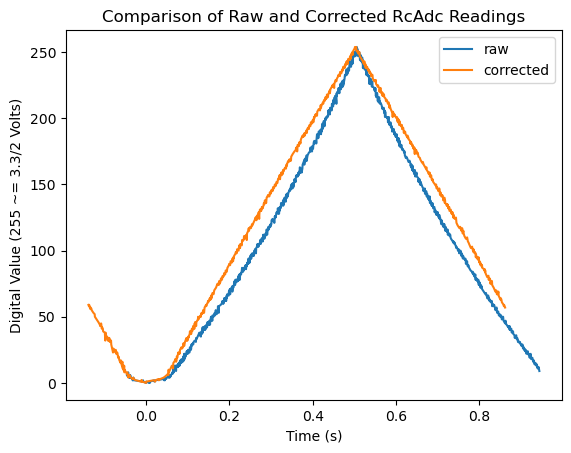

# `rc-adc`

TODO: Document how to use/how the RC circuit should be set up. For now, here's
a pretty graph:

Alt text: Picture of two plots of time versus digital output value. A triangle
ramp wave was applied to the ADC comparator's positive terminal. The FPGA
applies a 3.3V signal an RC circuit; the comparator's negative terminal is
connected to the high side of the capacitor. The FPGA counts how many clock
cycles it takes before the voltage across the capacitor in the RC circuit
becomes more positive than the comparator's positive terminal. When this
happens, the comparator goes from outputting a 1 and starts outputting a 0. The
FPGA charges the RC circuit for a harcoded number of clock cycles that
corresponds 3.3/2 Volts. Once that voltage is reached, the FPGA discharges
the RC circuit back to 0V and the process repeats.

The time it takes for the RC circuit to charge to a specific voltage
is not linear. A LUT and multiplier created alongside the ADC converts the
raw clock cycle count to a linear digital reading from 0 to 255. The
difference in shape between the raw (blue) and corrected (yellow) plots
is apparent, with the blue plot being noticably more curved, and the yellow
plot more linear.

The comparator only activates at a voltage difference above 100mV or so. Below
100mV, both the raw and corrected plots slowly bend toward a digital reading
of 0, indicating nonlinearities. This is in contrast to the expected sudden
transition that occurs in the triangle ramp applied to the ADC comparator's
positive terminal when it reaches 0 Volts. The closer _both_ the positive and
negative terminal voltages are to 0, the less likely the comparator will
correctly detect that the positive terminal was ever above the negative
terminal at all. This in turn distorts the how many cycles the FPGA counts
before the RC circuit voltage goes above the positive terminal, and so very
low input voltages get mapped to lower counts/linear readings than they
should. AFAIK, there is not much I can do about this.
